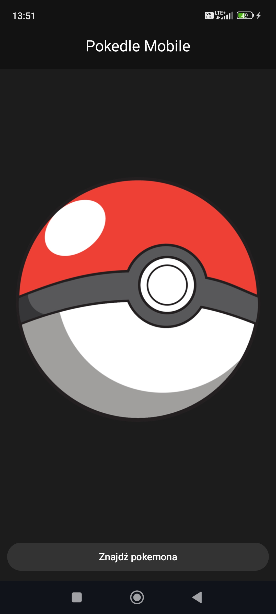
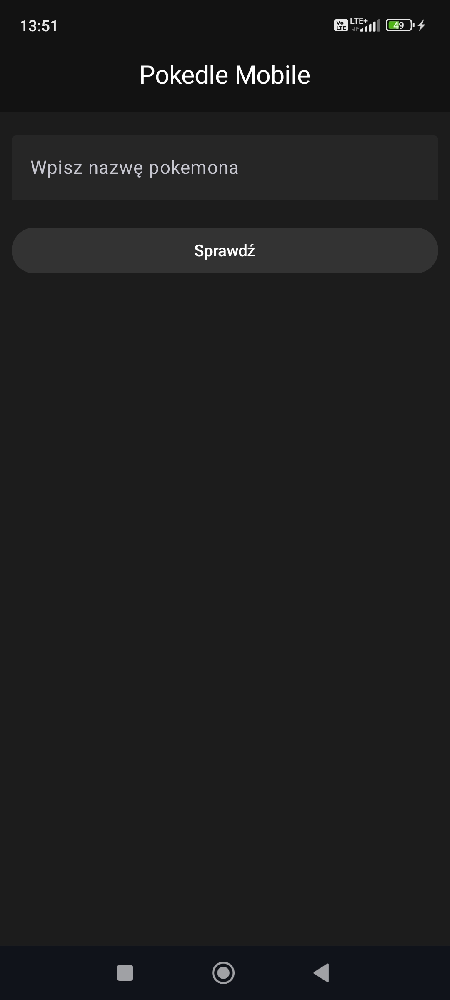
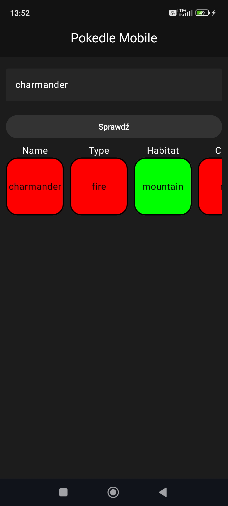
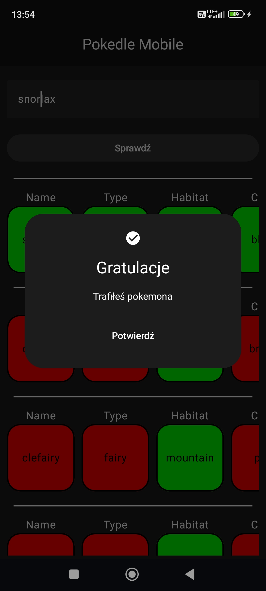

# PokedleMobile

PokedleMobile is a mobile application inspired by the popular web-based game https://pokedle.net/.  
The user tries to guess a hidden Pokémon by entering its name. 
After each guess, the application provides hints such as type, 
color, and other attributes, indicating whether they match the 
target Pokémon.

Using these hints, the player must identify the correct Pokémon 
in as few attempts as possible.

## 📌 Application

The start screen displays the Pokémon logo and a button to begin the game.

This is the main screen of the application, where the user can 
enter a Pokémon name and check whether it matches the target Pokémon.

After submitting a guess, a rotating puzzle appears. Red indicates no match with
the target Pokémon, while green indicates a correct attribute.

After a correct guess, a dialog appears in the center of the screen informing 
the user that the Pokémon has been successfully identified.

The final screen shows the number of attempts it took the user to guess the correct Pokémon.

## 🛠️ Technologies Used

- **Kotlin** – main programming language
- **Android SDK** – mobile application development
- **Room** – local database for storing Pokémon data
- **Ktor** – HTTP client for API communication
- **Gson** – JSON parsing
- **Koin** – dependency injection
- **Coil** – image loading
- **Voyager** – navigation framework
- **PokeAPI** – external REST API used to retrieve Pokémon data (https://pokeapi.co/)